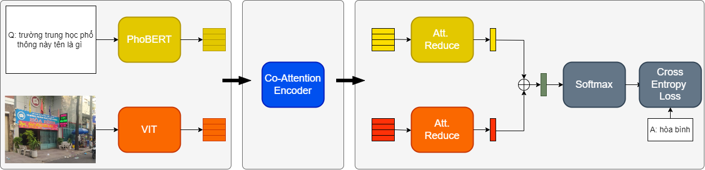

# Deep Modular Co-Attention Networks (MCAN)

This repository corresponds to the **PyTorch** implementation of the MCAN for VQA in Vietnamese,
orignal MCAN: https://github.com/MILVLG/mcan-vqa
[paper](https://openaccess.thecvf.com/content_CVPR_2019/html/Yu_Deep_Modular_Co-Attention_Networks_for_Visual_Question_Answering_CVPR_2019_paper.html)

By using the commonly used bottom-up-attention visual features, a single MCAN model delivers **53.78%**  overall accuracy on the *test* split of *ViVQA* dataset respectively, which significantly outperform existing state-of-the-arts model in Vietnamese. Please check "ViVQA: Vietnamese Visual Question Answering" paper [paper](https://aclanthology.org/2021.paclic-1.72/) for details.



## Updates

June 2, 2023

## Table of Contents
0. [Prerequisites](#Prerequisites)
0. [Training and Validation](#Training-and-Validation)
0. [Testing](#Testing)
0. [Pretrained models](#Pretrained-models)


## Prerequisites

#### Software and Hardware Requirements

You may need a machine with at least **1 GPU (>= 8GB)**, **20GB memory** and **50GB free disk space**.  We strongly recommend to use a SSD drive to guarantee high-speed I/O.

You should first install some necessary packages.

1. Install [Python](https://www.python.org/downloads/) >= 3.5
2. Install [Cuda](https://developer.nvidia.com/cuda-toolkit) >= 9.0 and [cuDNN](https://developer.nvidia.com/cudnn)
3. Install [PyTorch](http://pytorch.org/) >= 0.4.1 with CUDA (**Pytorch 1.x, 2.0 is also supported**).

	```bash
	$ pip install -r requirements.txt
	```

#### Dataset

1. Download the ViVQA dataset, more information about relevant published papers and datasets, please visit [ViVQA]( http://nlp.uit.edu.vn).


And finally, the `datasets` folders will have the following structure:

```angular2html

-- data
  |-- train-val
  |  |-- 000000000001.jpg
  |  |-- ...
  |-- test
  |  |-- 000000000002.jpg
  |  |-- ...
  |-- vivqa_train.json
  	|-- 
		{
			"images": [
				{
					"id": 68857,
					"filename": "000000068857.jpg",
					"filepath": "train"
				},...
			]
			"annotations": [
			{
				"id": 5253,
				"image_id": 482062,
				"question": "cái gì trên đỉnh đồi cỏ nhìn lên bầu trời xanh sáng",
				"answers": [
					"ngựa vằn"
				]
			},...
		}
	|-- vivqa_dev.json
	   |--
	|-- vivqa_test.json
       |--

```


## Training and Validation

The following script will start training with the default hyperparameters in config.yaml

```bash
$ python3 main.py --config config.yaml
```

##Testing

You must go to main.py file and comment like :"#STVQA_Task(config).training()"
Then go to config.yaml file and fix the "images_folder" to test images folder like: "images_folder: test"
```bash
$ python3 main.py --config config.yaml
```

## Pretrained models

We use two pretrained models, namely the ViT(Vision Transfomer)[paper](https://arxiv.org/abs/2010.11929) and PhoBERT[paper](https://arxiv.org/abs/2003.00744)


